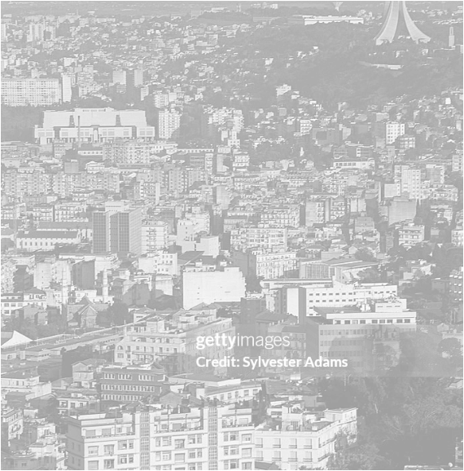
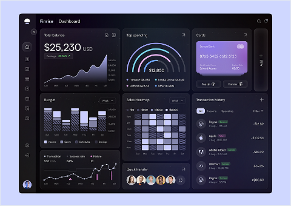
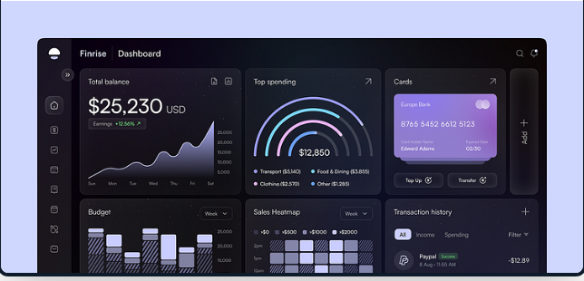
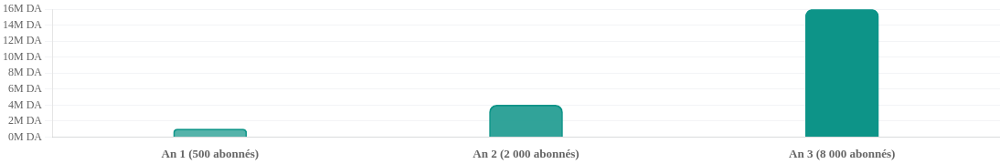

# MATAX - Pitch Deck Comité National

- Source: `MATAX - Pitch Deck Comité National.pptx`
- Total slides: 15

## Slide 1

PITCH DECK — Comité National de Labellisation des Projets Innovants, Startups et Incubateurs

MATAX

Plateforme de Conformité Fiscale Intelligente

"La conformité fiscale, simplifiée pour tous."

### Speaker Notes

1

## Slide 2

Sommaire

Présentation générale

Problématique ciblée

01

05

Informations de contact

Solution proposée

02

06

Résumé du projet

Prototype

03

07

PI, valeur, concurrence, marché, modèle, roadmap

L’équipe

04

08

MATAX — Comité National de Labellisation des Projets Innovants

02

### Speaker Notes

2

## Slide 3

Présentation Générale

Nom du projet: MATAX

"Votre conformité fiscale, en quelques clics."

Description:

Matax est une plateforme numérique qui permet aux entreprises, commerçants immatriculés, particuliers assujettis et experts-comptables de gérer l’intégralité de leurs obligations fiscales DGI

Déclarations automatisées, calculs conformes aux lois en vigueur, tableau de bord des obligations personnalisé

Conformité DGI 2026

Consultation professionnelle en option pour les cas complexes

"MATAX — Comité National de Labellisation des Projets Innovants"

03

### Speaker Notes

3

## Slide 4

Informations de Contact

Responsable du Projet

Hamoum Ikram

Plateforme

https://matax-frontend.onrender.com/

Fondatrice & PDG

Localisation

Tiaret, Algérie

Email

ikramhamoum00@gmail.com

M

"Votre comptable numérique, disponible 24h/24."

Téléphone

0672532599

"MATAX — Comité National de Labellisation des Projets Innovants"

04

### Speaker Notes

4

## Slide 5

Résumé du Projet

PROBLÈME

SOLUTION

IMPACT ATTENDU

•

La fiscalité algérienne est complexe, instable et intimidante

•

Automatisation des déclarations (G50, G11, G04)

•

Conformité accessible à tous (particuliers, entreprises, professionnels)

•

La législation change chaque année; les calculs sont sources d’erreurs; démarches chronophages

•

Calcul IRG, IBS et TVA selon le code fiscal DGI 2026

•

Moins d’erreurs/pénalités, moins de temps perdu

•

Tableau de bord personnalisé + consultation professionnelle en option

"MATAX — Comité National de Labellisation des Projets Innovants"

05

### Speaker Notes

5

## Slide 6

L'Équipe

Hamoum Ikram

Fondatrice & PDG

Parcours

Licence en Sciences Financières et Comptables (2024)

Master en Comptabilité et Fiscalité (en cours)

Terbass chez Naftal et Sonelgaz — systèmes de gestion financière

Expérience en cabinets comptables agréés — déclarations fiscales terrain

Ancienne gestionnaire/superviseure dans une société d’assurances

Compétences

Comptabilité

Fiscalité

Gestion administrative

Leadership

Entrepreneuriat

"MATAX — Comité National de Labellisation des Projets Innovants"

06

### Speaker Notes

6

## Slide 7

La fiscalité algérienne : complexe, instable, et coûteuse à gérer

Une législation en mouvement permanent

Changements annuels (taux, régimes, formulaires)

La peur des pénalités

Majorations, pénalités, redressements

Des calculs sources d’erreurs

IRG, IBS, TVA, abattements, cotisations

Du temps perdu entre les administrations

DGI, CASNOS, CNRC, centres des impôts

Une procédure perçue comme opaque

« jibâiya » intimidante, obligations méconnues

Un accès à l’expertise difficile

20 000 à 80 000 DA/mois

"MATAX — Comité National de Labellisation des Projets Innovants"

07

### Speaker Notes

7

## Slide 8

La Solution Proposée

1. 📋 Génération de déclarations

2. 🧮 Calcul d’impôts

3. 📅 Tableau de bord des obligations

IRG salarial/professionnel, IBS (19/23/26%), TVA (19% / 9%) — conforme DGI 2026

G50 (TVA mensuelle/trimestrielle), G11 (déclaration annuelle), G04 (déclaration employeur) — formulaires pré-remplis, prêts à soumettre à la DGI

profil par type d’entité + calendrier + alertes

4. 💬 Assistant fiscal DGI

5. 👨‍💼 Consultation professionnelle (option)

réponses basées sur textes officiels (LF 2026) avec citation d’articles

mise en relation avec experts agréés

"MATAX — Comité National de Labellisation des Projets Innovants"

08

### Speaker Notes

8

## Slide 9

Prototype

Notre Prototype — Déjà en ligne

Plateforme opérationnelle: création de compte, profil fiscal, calculateurs, génération de déclarations. Parcours guidé étape par étape, sans jargon inutile.

Accessible en ligne

Interface en français

Calculs conformes DGI 2026

Lien :

https://matax-frontend.onrender.com/

Compte utilisateur sécurisé

"MATAX — Comité National de Labellisation des Projets Innovants"

09

### Speaker Notes

9

## Slide 10

Propriété Intellectuelle

🏷️ Marque MATAX

dépôt de marque en cours auprès de l’INAPI

💻 Plateforme web

droits d’auteur sur le code source et l’interface utilisateur

⚙️ Moteur de calcul fiscal

•

algorithme propriétaire IRG/IBS/TVA conforme DGI, mis à jour à chaque loi de finances

"MATAX — Comité National de Labellisation des Projets Innovants"

10

### Speaker Notes

10

## Slide 11

Ce que Matax apporte à chaque utilisateur

⏱ Déclarations en minutes

✅ Zéro erreur de calcul

sans déplacement ni rendez-vous

moteur fiscal automatisé, mis à jour

📚 Toujours à jour

📱 Disponible 24h/24, 7j/7

intégration automatique des changements législatifs

multi-appareils

🔒 Données sécurisées

🤝 Un outil pour les experts-comptables

espace personnel et confidentiel

gestion client plus rapide

👨‍💼 L’humain quand nécessaire

consultation pro en option

"MATAX — Comité National de Labellisation des Projets Innovants"

11

### Speaker Notes

11

## Slide 12

Analyse Concurrentielle

Pourquoi Matax se démarque

Critère

Matax

Moustachir.dz

Faire soi-même

Disponibilité

24/7 en ligne

Sur rendez-vous

Toujours mais risqué

Coût

Abonnement abordable

Honoraires élevés

Gratuit mais risqué

Vitesse

Minutes

Jours

Lent et incertain

Conformité DGI 2026

Automatique

Dépend du consultant

Non garantie

Autonomie utilisateur

Totale

Nulle

Partielle

Consultation pro disponible

✅ En option

✅ Uniquement ça

❌

"MATAX — Comité National de Labellisation des Projets Innovants"

12

### Speaker Notes

12

## Slide 13

Marché Cible

Statistique Centrale

+1 500 000

entités immatriculées au CNRC en Algérie

Entreprises (EURL, SARL, SPA)

Commerçants immatriculés (RC)

Particuliers assujettis

Experts-comptables & fiduciaires

Professions libérales, revenus locatifs, IRG non salarial

Obligations IBS, TVA, G04, G11 — besoin de conformité complète et régulière

Artisans, importateurs, détaillants — G50, TVA, IBS selon régime

Multi-dossiers (segment futur) — professionnels gérant plusieurs clients

"MATAX — Comité National de Labellisation des Projets Innovants"

13

### Speaker Notes

13

## Slide 14

Modèle Économique

Phase actuelle — V1

Vision future

Formule

Cible

Contenu prévu

Abonnement unique donnant accès à toutes les fonctionnalités (G50/G11/G04, IRG/IBS/TVA, tableau de bord, assistant DGI). Consultation professionnelle en option.

Starter

Particuliers / auto-entrepreneurs

Fonctions de base

PME

TPE, SARL, commerçants

Accès complet

Expert

Comptables, fiduciaires

Multi-dossiers, exports, support prioritaire

Projections de revenus

"MATAX — Comité National de Labellisation des Projets Innovants"

14

### Speaker Notes

14

## Slide 15

Merci

"Construisons ensemble la conformité fiscale de demain en Algérie."

Hamoum Ikram — Fondatrice & PDG, MATAX

ikramhamoum00@gmail.com

0672532599

https://matax-frontend.onrender.com/

"MATAX — La fiscalité algérienne, enfin accessible à tous."

### Speaker Notes

15
