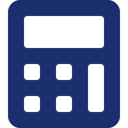

# MaTax_Presentation

- Source: `MaTax_Presentation.pptx`
- Total slides: 9

## Slide 1

MaTax

منصة التسيير الجبائي الرقمي الذكي

جامعة ابن خلدون تيارت | ماستر محاسبة وجباية | 2025/2026

إعداد: حموم إكرام | إشراف: أ. بلعباس مخطار

### Speaker Notes

الشريحة الأولى: التعريف بالمشروع. اذكري اسم المشروع والجامعة والتخصص.

1

## Slide 2

02 | المشكلة والحل المقترح

⚠️ المشكلة

✅ الحل: MaTax

- تعقيد الإجراءات الجبائية وغياب الرقمنة
- أخطاء بشرية في الحسابات اليدوية
- غرامات التأخر بسبب ضياع المواعيد
- غياب أرشفة رقمية آمنة للوثائق
- فجوة بين التكنولوجيا والقانون الجزائري

- حساب آلي دقيق للضرائب وفق قانون المالية
- إعداد وإرسال تصاريح G50 تلقائياً
- تنبيهات ذكية بالمواعيد الجبائية
- أرشفة سحابية آمنة للوثائق الرسمية
- واجهة بسيطة لا تحتاج خبرة محاسبية

→

### Speaker Notes

الشريحة الثانية: اشرحي المشكلة الجبائية الحقيقية في الجزائر ثم قدمي MaTax كالحل الذكي.

2

## Slide 3

03 | الجوانب الابتكارية

تكامل المسار الجبائي

واجهة مستخدم بسيطة

تنبيهات ذكية

منظومة رقمية واحدة تجمع الحساب والأرشفة والاستشارة

تجربة رقمية سلسة بدون خبرة محاسبية مسبقة

إشعارات استباقية بمواعيد التصريح والدفع

أمن البيانات

سجل جبائي موحد

شراكات استراتيجية

تشفير عالي وحماية وفق القانون الجزائري 18-07

ملف إلكتروني شامل يرافق المؤسسة في مسار نموها

شبكة من المحاسبين المعتمدين وحاضنات الأعمال

### Speaker Notes

الشريحة الثالثة: ركزي على أن MaTax ليست مجرد برنامج محاسبي بل منظومة متكاملة.

3

## Slide 4

04 | تحليل السوق والمنافسة

السوق الإجمالي (TAM)

السوق المتاح (SAM)

السوق المستهدف (SOM)

2.88 مليار دج

768 مليون دج

38.4 مليون دج

30,000 مؤسسة على مستوى وطني

8,000 مؤسسة في تيارت والولايات المجاورة

400 عميل في السنة الأولى (5%)

تحليل SWOT - ملخص

القوة

الضعف

الفرص

التهديدات

ريادة محلية، تكامل المسار، دقة الحساب

تكاليف التطوير، الحاجة لكتلة حرجة

دعم الدولة للرقمنة، نمو المقاولاتية

المنافسة التقليدية، تذبذب الإنترنت

### Speaker Notes

الشريحة الرابعة: أرقام السوق مدعومة بإحصائيات المؤسسات الناشئة في الجزائر.

4

## Slide 5

05 | خطة الإنتاج والتنظيم

01

02

03

04

05

التأسيس والمسح

التطوير التقني

الإطلاق التجريبي

التوسع

الإطلاق الرسمي

ش 1-2

ش 3-6

ش 7-8

ش 9-10

ش 11-12

دراسة ميدانية وانتقاء المؤسسات الشريكة

بناء نظام ERP وتطوير التطبيق والواجهات

اختبار المنصة مع مجموعة من المؤسسات

حملات تسويقية وشراكات استراتيجية

اختبارات الجودة والإطلاق الكامل لجميع الخدمات

الهيكل التنظيمي: CEO → قسم تقني + قسم جبائي + قسم تسويق + قسم مالي

### Speaker Notes

الشريحة الخامسة: اشرحي الخارطة الزمنية المرحلية بالتفصيل.

5

## Slide 6

06 | التكاليف والإيرادات

📊 التكاليف السنوية

💰 الإيرادات السنوية

اشتراكات الباقات (SaaS)

3,840,000 دج

الاستثمارات (معدات + منصة)

2,898,000 دج

الخدمات بالوحدة

2,388,000 دج

الأجور السنوية

3,808,200 دج

عمولات الشراكات

962,000 دج

المشتريات المباشرة

280,000 دج

التكوين والتدريب

1,680,000 دج

الأعباء غير المباشرة

1,042,000 دج

الإعلانات وتسويق البيانات

740,000 دج

إجمالي الإيرادات السنة الأولى:

9,610,000 دج

### Speaker Notes

الشريحة السادسة: اشرحي مصادر الدخل الخمسة وأبرزي هامش الربح التشغيلي 46.6%.

6

## Slide 7

07 | نموذج الأعمال التجاري (BMC)

الشركاء الرئيسيون

الأنشطة الرئيسية

القيمة المقترحة

علاقات العملاء

شرائح العملاء

- مكاتب المحاسبة
- حاضنات الأعمال
- مزودو السحابة

- تطوير المنصة
- تحديث القوانين
- دعم العملاء

- تسيير جبائي آلي
- أمان قانوني
- توفير الوقت والمال

- دعم فني مباشر
- تدريب رقمي
- تقييم مستمر

- المقاولون الذاتيون
- المؤسسات الصغيرة
- المهنيون المستقلون

الموارد الرئيسية

القنوات

- فريق تقني
- قاعدة بيانات قانونية
- علاقات مهنية

- تطبيق موبايل
- موقع إلكتروني
- شبكة شركاء

هيكل التكاليف

مصادر الإيرادات

تطوير المنصة 1.5م دج | الأجور 3.8م دج | التسويق 240 ألف دج

اشتراكات SaaS | خدمات بالوحدة | شراكات | تدريب | إعلانات

### Speaker Notes

الشريحة السابعة: نموذج الأعمال BMC يوضح كيف يخلق MaTax قيمة ويحقق الربحية.

7

## Slide 8

08 | النموذج التجريبي الأولي (Prototype)

🖥 لوحة التحكم - MaTax Dashboard

مميزات النموذج الأولي

✅ حساب آلي للضرائب

إجمالي الإيرادات

إجمالي المصاريف

صافي الربح

1,250,000 دج

890,000 دج

360,000 دج

📤 إرسال تصاريح G50

📈 تطور الإيرادات الشهري

📄 إرسال تصريح G50

☁️ أرشفة سحابية آمنة

الفترة: الثاني 2025

النوع: TVA

🔔 تنبيهات المواعيد

إرسال

📊 تقارير مالية فورية

🔐 حماية البيانات 18-07

### Speaker Notes

الشريحة الثامنة: اعرضي الواجهة البصرية للمنصة وأكدي أنها قابلة للتطوير التدريجي.

8

## Slide 9

09 | الشهادات والإنجازات

تربص ميداني

خبرة مهنية

مشروع مبتكر

دعم أكاديمي

مؤسسة نافطال + مجمع سونلغاز

مع محافظ حسابات وخبير قضائي + محاسب معتمد من وزير المالية

في إطار القرار الوزاري 1275 للمؤسسات الناشئة

إشراف أ. بلعباس مخطار + أ. مفتاح فاطمة

مؤشرات الجدوى المالية

صافي القيمة الحالية

مدة الاسترداد

نقطة التعادل

هامش الربح

79.6 مليون دج

1 سنة و9 أشهر

61 عميل

46.6%

إيجابي جداً

سريع

الشهر الرابع

مرتفع

MaTax — من تيارت إلى رقمنة الجزائر الجبائية 🇩🇿

### Speaker Notes

الشريحة التاسعة: أبرزي خبرتك الميدانية ثم اختمي بثقة بجملة قوية عن مستقبل MaTax.

9
